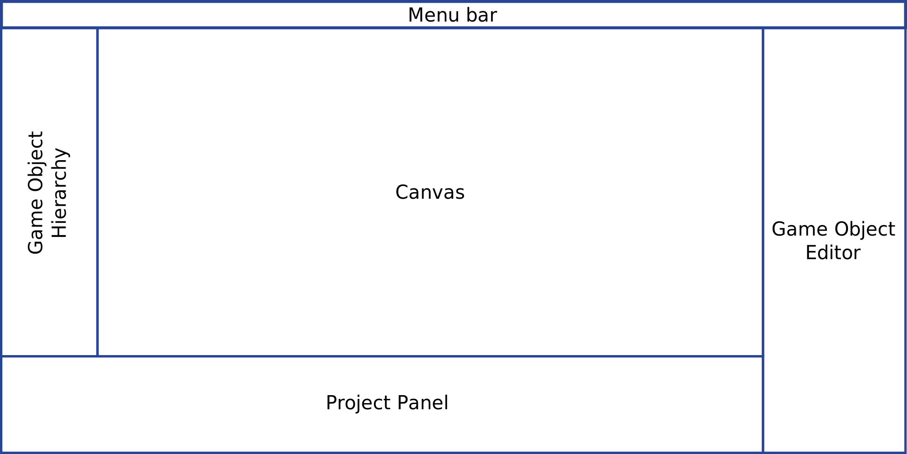

Editor
*****

The editor is written in JavaScript/HTML/CSS, and runs on a Webkit-based
window. The plethora of javascript libraries available on the internet allowed
the editor to be written extremely quickly, with a large amount of highly
interactible GUI elements. By combining AngularJS and ThreeJS, it was possible
to separate entities from their data, while still keeping them consistent in a
very manageable way. All of this would've had required a very large effort to
be accomplished with other languages, such as C++.

=======
Folder structure
=======
Any source code related to the editor is located inside ``$REPO_ROOT$/src/editor``. The ``development/`` folder contains the relevant source code, which was scaffolded with the `Yeoman tool <http://www.yeoman.io>`_; ``dist/`` will contain the compiled editor in the form of minified files, and is generated with the command ``grunt build -f``.

The relevant source code for the editor module lies within the ``development/app`` folder. It can be previewed in development mode by running ``grunt serve``.

====
Layout
====
The layout structure is defined in the file ``views/main.html``. It is composed of five major elements, namely:

* **Menu bar** Header element. Contains the major menu bar (File, Edit, etc), and the preview button.
* **Hierarchy** List of all game objects in the current scene.
* **Canvas** Edit/preview render canvas.
* **Game Object Editor** Panel for adding and editing game object components.
* **Project Panel** List of all assets in the current project.

Each layout element is implemented as an AngularJS `directive <https://docs.angularjs.org/guide/directive>`_. They are implemented in the following files:

* **Menu bar** ``views/directives/menu_bar.html`` (view) and ``scripts/directives/menu_bar.js`` (logic).
* **Hierarchy** ``views/directives/game_object_hierarchy.html`` (view) and ``scripts/directives/game_object_hierarchy.js`` (logic).
* **Canvas** ``scripts/directives/edit_canvas.js`` (logic).
* **Game Object Editor** ``views/directives/game_object_editor.html`` (container view), ``scripts/directives/game_object_editor.js`` (high leven and panel initialization logic) and ``scripts/lau/component_prototypes.js`` (component instantiation logic).

  * **Component Editor** Each component type (like Transform and Script) is implemented as a ``component-editor`` directive (which is defined in ``scripts/directives/component_editor.js``), with their views dynamically determined based on the type of their flyweight component. Their views are located inside ``views/directives/component_editors/``.
  * **Script component Editor** Each script field widget (number editor, color picker, etc) is a directive implemented in ``scsripts/directives/script_field.js``, and whose view dynamically determined and loaded from ``views/directives/component_editors/script_fields``.
* **Project Panel** ``views/directives/project_panel.html`` (view) and ``scripts/directives/project_panel.js`` (logic).

==================
Game Object Editor
==================

All game objects are stored in the array ``$scope.gameObjects``, defined in ``scripts/controllers/main.js``. The boolean ``$scope.currentGameObjectId`` contains the index of the currently selected game object (the one highlighted in the hierarchy).

Each game object is an instance of a prototype defined in ``scripts/lau/game_object.js``. It has an array of components, whose prototypes are defined in ``scripts/lau/component_prototypes.js``.

-----------------------
Script Field directives
-----------------------

.. class:: numberInput

   This directive creates a number input whose value can be changed by dragging the mouse. A label can be specified via the ``label`` attribute.

   :param lblClass: CSS class for the input label. Default: ``number-input``.
   :param lblId: ID for the label wrapper.
   :param label: Label text.
   :param inpClass: CSS class for the input tag.
   :param inpId:  ID for the input tag.
   :param sensitivity: Defines how much will the input value change for each pixel that the mouse moves. Default: ``0.109375``.

====
Events
====
`Events <http://gameprogrammingpatterns.com/event-queue.html>`_ are the way different modules of the interface communicate with each other.

----
Listening and broadcasting events
----

.. function:: $event.listen(event_name, callback)

   Listen to an event. The callback function will be called whenever the event is raised. It is possible to have many listeners to each event.

   :param event_name: String defining the name of the event.
   :param event_data: Callback function that will be executed when the event is broadcast.

Sample:

.. code-block:: javascript

    $event.listen('myEvent', function(eventData) {
        console.log(eventData);
    });

.. function:: $event.broadcast(event_name, event_data)

   Broadcasts an event with name defined by the string event_name. Every listener will receive event_data as a parameter.

   :param event_name: String defining the name of the event.
   :param event_data: Object with the event data.

Sample:

.. code-block:: javascript

    $event.broadcast('myEvent', {id: 123});

----
Available events
----

========================= ========================================
 Event name                Description                            
========================= ========================================
 gameObjectCreated         A new gameobject was created.
                           **Parameter:** The numeric index
                           referring to the position of the new
                           gameobject in the $scope.gameObjects
                           array.
 initialAssetList          Raised when the user asset list is
                           received for the first time.
                           **Parameter:** Array of asset objects with
                           format {flyweight: AssetFlyweight, label:
                           "file_name", type: "file_type"}. For more
                           information on asset types and flyweights,
                           refer to :ref:`Asset Types <asset-types>`.
 transformComponentAdded   Whenever the Transform component is added
                           to the currently selected game object.
                           **Parameter:** The transform component
                           flyweight. For more information on this object,
                           refer to :ref:`Asset Types <asset-types>`.
========================= ========================================

=============
Socket events
=============
Socket events are events that are broadcast to the server module. To broadcast a message to the server, use ``$socket.broadcast("event_name", eventData)``.
The server can also broadcast events to the Editor frontend (check out the list of server events :ref:`here <server-events>`). To subscribe, simply listen to the corresponding event with the ``$event`` object:

.. code-block:: javascript

   $event.listen("server_event", function(eventData) {
     console.log(eventData);
   });

The socket module is implemented in ``scripts/socket.js``.

====
RPCs
====
RPC stands for *Remote Procedure Call*. There are many functions implemented in the server module (like script compilation and file monitoring) that the editor frontend must trigger, and they do so by exchanging websocket messages.

Whenever the editor needs to trigger a server function, it does so by broadcasting the `RPCCall` socket event to the server, with the following parameter:

.. code-block:: javascript

   {
     procedure: "procedure_name",
     from: randomUniqueID,
     parameters: userParameters
   }

The server receives this request, processes it (to see the details on server-side RPCs, check out :ref:`Server RPC <server-rpc>`) and returns an object to the callee (the return value varies across functions -- refer to :ref:`Server RPC <server-rpc>` for more info on this).

In order to call an RPC, use the ``$rpc.call(procedureName, parameters, callback)`` function. Example:

.. code-block:: javascript

   $rpc.call("serverMethod", {data: 12}, function(returnValue) {
     console.log(returnValue);
   });

The RPC module is implemented in ``scripts/rpc.js``.

====
Creating component types
====

====
Creating component widgets
====

.. _asset-types:

======
Asset Types
======
Asset flyweight formats...
